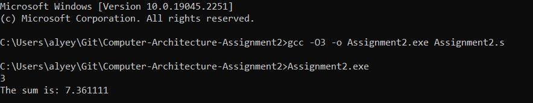

# Computer-Architecture-Assignment2
* Write a 32-bits intel-syntax assembly program that can be compiled in the same way the 32-bits lab samples are compiled.

## Input
* An integer n.
* n floating point numbers (Use the "double" type. Do not use "float" type.)

## Output
The program should output (1 + 1/1) + (2 + 1/4) + (3 + 1/9) + (4 + 1/16) + ... + (n + 1/(n^2)).

## Operation
> To compile this assembly program on Windows, enter the following two commands into the command prompt:
> * `gcc -O3 -o Assignment2.exe Assignment2.s`
> * `Assignment2.exe` 
> After running the program, enter a positive integer and press Enter

## Example

